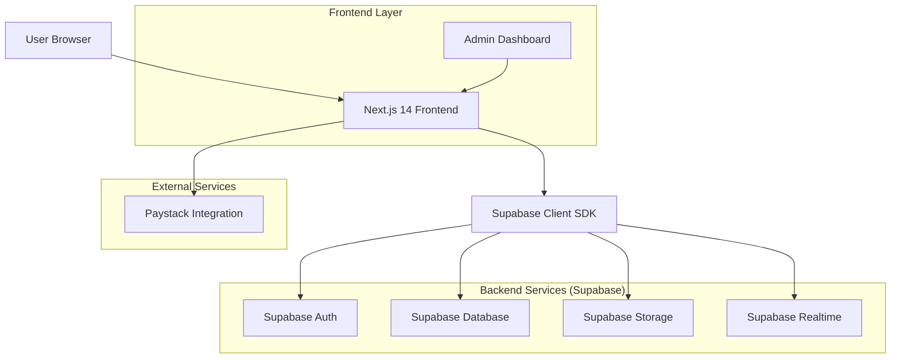

# Pact Marketplace - Technical Architecture Document

## 1. Architecture Design



## 2. Technology Stack

- **Frontend**: Next.js 14 + TypeScript + Tailwind CSS
- **Initialization Tool**: create-next-app
- **Backend**: Supabase (Auth, Database, Storage, Realtime)
- **Payment**: Paystack API
- **Maps**: Mapbox/Leaflet for location display
- **PWA**: Next.js PWA configuration
- **State Management**: React Context + Supabase Realtime

## 3. Project Structure

```
pact-marketplace/
├── src/
# Pact Marketplace - Technical Architecture (Current Snapshot)

## Stack & Runtime
- Next.js App Router (TypeScript), Tailwind, shadcn/ui components.
- Supabase: Auth, Postgres, Storage (listing-images bucket), RPCs.
- Payments: Paystack (initialize/verify via server actions and services).
- Middleware: session refresh + in-memory rate limit (60 rpm per IP, web/api scope).

## High-Level Flow
- Public landing/marketplace browsing; pools shown with committed/remaining units.
- Join pool: server action `joinPool` → Supabase RPC for reservation (expected `reserve_pool_membership`/`join_pool`) → Paystack init → payment callback handled by `verifyPoolPayment` to mark `pool_members` authorized and increment pool quantity.
- Pool lifecycle intended: active → locked when min reached → orders created and payments captured → completed or cancelled/expired (capture/lock RPCs missing).
- File uploads: Supabase storage bucket `listing-images` with RLS (public read; owner update/delete).

## Routing (representative)

## Data Model (aligned to supabase/schema.sql)
- `profiles`: id (auth.users FK), email, role (buyer/farmer/admin), verification flags, location/meta; RLS owner + admin update.
- `listings`: farmer-owned product entries with price/unit/quantity/images/status.
- `pools`: per-listing pooling campaigns with leader, min/current qty, status, expiry, geo.
- `pool_members`: composite key (pool_id, user_id); quantity_pledged, amount_pledged, payment_status (pending/authorized/captured/voided), payment_reference.
- `orders`: buyer orders linked to pool/listing; payment_status (pending/paid/failed/refunded) and status (pending/confirmed/delivered/cancelled).
- `pool_chat`: messages per pool with user FK.
- `notifications`: per-user messages/read flag.
- `contact_submissions`: inbound contact forms with status and admin notes.
- Storage: bucket `listing-images` with RLS policies for public read and owner mutations.

## RPCs / DB Logic
- Present: `reserve_pool_membership`, `increment_pool_quantity`, `get_farmer_available_balance`.
- Missing but referenced: `join_pool`, `process_pool_lock`, `create_orders_for_pool`, `deduct_pool_inventory` (needed for automatic lock/capture/order creation).

## Security & Access
- RLS enabled across tables; admins can update/delete where noted; public select for listings/pools/pool_chat; pool_members insert/update restricted to user.
- Middleware rate limits requests and refreshes Supabase session; returns rate-limit headers.
- Payments: verify via Paystack; refunds/webhook signature verification not yet implemented.

## Gaps / TODOs
- Implement missing RPCs for join/lock/order creation and inventory deduction.
- Add cron/edge function for pool expiry/locking and payout processing.
- Enforce role-based routing for buyer/farmer/admin areas.
- Add webhook verification + refund/chargeback handling.
- Add PWA assets (manifest, service worker) and offline fallbacks.
interface PaymentVerificationQuery {
  tx_ref: string;
  status: string;
  transaction_id?: string;
}

interface PaymentVerificationResponse {
  success: boolean;
  message: string;
  orderStatus: string;
}

// POST /api/orders/[id]/confirm-receipt
interface ConfirmReceiptRequest {
  orderId: string;
}

interface ConfirmReceiptResponse {
  success: boolean;
  message: string;
}
```

## 7. Security Implementation

### 7.1 Authentication & Authorization

- Supabase Auth with email/password and Google OAuth
- Role-based access control (RBAC) using app_role enum
- Row Level Security (RLS) policies on all tables
- JWT token management with @supabase/ssr
- Rate limiting on authentication endpoints
- CAPTCHA protection on registration

### 7.2 Data Protection

- All sensitive data encrypted at rest
- HTTPS enforced for all communications
- Input validation and sanitization
- SQL injection prevention through parameterized queries
- XSS protection with proper output encoding

### 7.3 Payment Security

- Paystack PCI DSS compliance
- No card data stored locally
- Transaction verification before order completion
- Idempotent payment processing

## 8. Performance Optimization

### 8.1 Database Optimization

- Proper indexing on frequently queried columns
- Query optimization with EXPLAIN ANALYZE
- Connection pooling with Supabase
- Database maintenance and vacuuming

### 8.2 Frontend Optimization

- Next.js Image optimization for all images
- Code splitting and lazy loading
- Service worker for offline functionality
- Progressive Web App (PWA) features
- CDN integration for static assets

### 8.3 Caching Strategy

- Browser caching for static assets
- Supabase query caching
- Real-time data invalidation
- Stale-while-revalidate for API responses

## 9. Real-time Features

### 9.1 Supabase Realtime Implementation

- Pool progress updates
- Order status notifications
- New listing alerts
- Payment confirmation broadcasts

### 9.2 WebSocket Connections

- Optimized connection management
- Automatic reconnection on disconnect
- Message queuing for offline users

## 10. Admin Dashboard

### 10.1 User Management

- View all users with filtering and search
- Role assignment and modification
- User suspension and reactivation
- Activity logs and audit trails

### 10.2 Listing Management

- Approve/reject farmer listings
- Monitor listing performance
- Handle reported content
- Bulk operations on listings

### 10.3 Analytics & Monitoring

- User registration and activity metrics
- Transaction volume and success rates
- Pool completion rates
- Revenue and commission tracking
- System health monitoring

## 11. PWA & Offline Functionality

### 11.1 Service Worker Features

- Offline page fallback
- Background sync for pending actions
- Push notification support
- App shell architecture

### 11.2 Offline Capabilities

- Browse cached listings
- View previously loaded content
- Queue actions for when online
- Offline payment status checking

## 12. Deployment & Infrastructure

### 12.1 Environment Variables

```bash
# Required environment variables
NEXT_PUBLIC_SUPABASE_URL=
NEXT_PUBLIC_SUPABASE_ANON_KEY=
SUPABASE_SERVICE_ROLE_KEY=
PAYSTACK_SECRET_KEY=
NEXT_PUBLIC_PAYSTACK_PUBLIC_KEY=
NEXT_PUBLIC_BASE_URL=
CAPTCHA_SITE_KEY=
CAPTCHA_SECRET_KEY=
```

### 12.2 Deployment Strategy

- Vercel for Next.js hosting
- Supabase for database and services
- CDN for static asset delivery
- Monitoring with Sentry or similar
- Automated CI/CD pipeline

## 13. Testing Strategy

### 13.1 Unit Testing

- Component testing with Jest
- API route testing
- Utility function testing
- Database function testing

### 13.2 Integration Testing

- End-to-end user flows
- Payment processing tests
- Real-time feature testing
- Cross-browser compatibility

### 13.3 Performance Testing

- Load testing for peak usage
- Database query performance
- API response time monitoring
- Frontend bundle size analysis

This architecture provides a solid foundation for building the Pact marketplace with scalability, security, and performance in mind.
